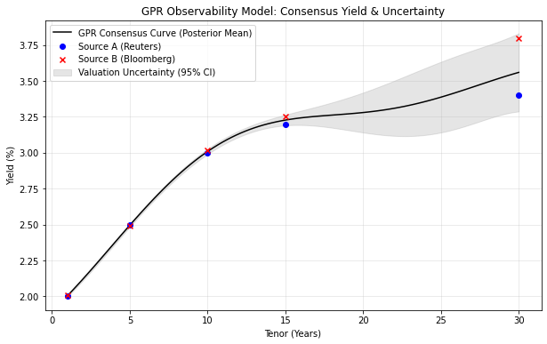
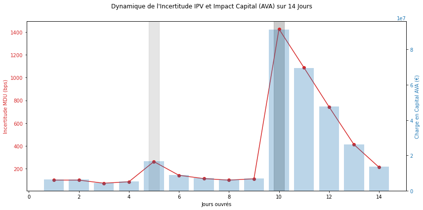

# Modélisation de l'Observabilité et Calcul d'AVA par Processus Gaussiens

## Overview
Ce projet propose une architecture quantitative pour évaluer le risque de valorisation des produits de taux (Fixed Income). Il vise à résoudre un problème majeur en salle de marchés : quantifier l'incertitude lorsqu'un produit devient illiquide ou lorsque les sources de marché (Bloomberg, Reuters) se contredisent. En utilisant la régression par processus gaussiens (GPR), ce modèle traduit le chaos du marché en une pénalité de capital réglementaire stricte (Additional Valuation Adjustment - AVA).

---

## 1. La Problématique de l'Observabilité
Pour valoriser un portefeuille de dérivés, une banque a besoin de courbes de taux précises. Cependant, sur les maturités longues (ex: 30 ans), le marché est souvent inobservable.
* **Le Bruit Microstructurel :** Les spreads Bid-Ask s'élargissent par manque de liquidité.
* **La Divergence des Courtiers :** En période de stress, les algorithmes de pricing des différents fournisseurs de données (Source A vs Source B) désaccordent violemment.

Prendre la simple "moyenne" de ces sources est dangereux. La banque doit modéliser **l'incertitude** autour de ce prix pour se conformer aux normes de *Prudent Valuation* (FRTB / EBA RTS).

---

## 2. Le Moteur de Pricing : Gaussian Process Regression (GPR)
Pour pallier les limites des interpolations classiques, le modèle utilise une approche d'apprentissage bayésien (GPR). 

Contrairement à une régression standard qui donne une seule ligne d'estimation, la GPR calcule une **distribution de probabilité** sur l'ensemble des courbes de taux possibles.
* **Le Prix de Consensus (Posterior Mean) :** Le "Juste Prix" utilisé pour calculer le P&L théorique du trader.
* **L'Incertitude (Posterior Variance) :** La mesure de l'inobservabilité. 

Le graphique ci-dessus illustre la puissance de la régression par processus gaussiens face à l'inobservabilité des marchés illiquides. Il se divise en deux régimes distincts :

* **La Zone de Haute Observabilité (1Y à 15Y) :** Sur les maturités courtes et moyennes, le marché est profond. Les sources de prix (Reuters en bleu, Bloomberg en rouge) convergent et le spread Bid-Ask est serré. Le modèle GPR traduit cette certitude par une **bande de variance (en gris) quasi nulle**. Le consensus (ligne noire) est robuste.

* **La Zone d'Incertitude et de Divergence (30Y) :** À 30 ans, la liquidité s'assèche. Une divergence massive de 40 points de base apparaît entre les deux courtiers. Le modèle ne se contente pas d'interpoler une moyenne ; il capte ce signal de détresse microstructurel. La bande d'incertitude à 95% (zone grisée) s'élargit drastiquement pour englober les cotations contradictoires. 

L'épaisseur de cette zone grise au point 30Y correspond exactement au **Market Data Uncertainty (MDU)**. C'est cette valeur mathématique qui, multipliée par la sensibilité du portefeuille (DV01), déterminera la pénalité réglementaire (AVA) infligée par le département des risques.
### Paramétrage du Bruit ($\alpha$)
L'innovation de ce PoC réside dans la définition dynamique du paramètre de bruit ($\alpha$) injecté dans le noyau (Kernel Matérn/RBF). Il est défini comme la somme de deux variances :
1. **La variance d'illiquidité :** Dérivée du spread Bid-Ask.
2. **La variance de divergence :** L'écart quadratique absolu entre les cotations des brokers.

---

## 3. Du Modèle Mathématique au Capital Réglementaire
L'incertitude donne lieu aux mesure réglementaire suivantes.

* **Market Data Uncertainty (MDU) :** C'est l'écart-type brut (1 Std Dev) extrait du modèle GPR à un nœud spécifique (ex: 30 ans).
* **Additional Valuation Adjustment (AVA) :** C'est la charge en capital (en euros) déduite du P&L du trader. 

La formule d'implémentation est la suivante :

$$AVA = MDU \times Z_{conf} \times DV01$$

où $Z_{conf}$ est le multiplicateur réglementaire. Par exemple, 1.28 pour un intervalle de confiance à 90%, et le $DV01$ est la sensibilité du portefeuille au point de base.

---

## 4. Simulation de Crise et Dynamique de l'AVA

Le graphique ci-dessous illustre le comportement du modèle lors d'un backtest de 14 jours, incluant deux événements macroéconomiques majeurs pour un portefeuille ayant une forte sensibilité (DV01) sur le nœud 30 ans.

### Analyse des Chocs et du Comportement du Modèle :

**A. La phase de calme (Jours 1-4) :**
Le marché est liquide. Les courtiers sont alignés et les spreads Bid-Ask sont serrés. Le modèle GPR est confiant : le MDU est faible (ligne rouge), et la retenue en capital AVA (barres bleues) est minime.

**B. Le choc de liquidité mineur (Jour 5 - NFP) :**
La publication du rapport sur l'emploi américain (*Non-Farm Payrolls*) surprend le marché. La volatilité augmente, ce qui pousse les *Market Makers* à écarter leurs spreads Bid-Ask. Le modèle capte cette baisse de liquidité, doublant temporairement la charge AVA avant que le marché ne digère l'information.

**C. L'effondrement de l'Observabilité (Jour 10 - FOMC) :**
La Réserve Fédérale prononce un discours ambigu. C'est le test ultime pour le modèle :
* Les algorithmes de Reuters l'interprètent à la baisse (Dovish).
* Les traders sur Bloomberg l'interprètent à la hausse (Hawkish).
* **Conséquence mathématique :** La divergence entre les sources explose. Le paramètre de bruit $\alpha$ sature. Le modèle bayésien réagit instantanément en élargissant massivement sa bande de variance.
* **Conséquence métier :** Le MDU (ligne rouge) connaît un pic vertical extrême. L'AVA (barres bleues) bondit proportionnellement, confisquant instantanément une part massive du P&L théorique du trader pour protéger la banque face à un marché devenu totalement inobservable.

**D. L'effet d'Hystérésis (Jours 11-14) :**
Suite au choc du FOMC, même si les prix commencent à converger, la charge AVA ne retombe pas immédiatement à zéro. Le modèle modère son retour à la normale, reflétant la persistance du risque de liquidité (Hystérésis). La banque maintient des réserves de capital prudentes tant que la profondeur de marché n'est pas pleinement restaurée.

---

## Conclusion
Ce prototype démontre qu'une approche par processus gaussiens permet de dépasser la simple vérification de prix (IPV standard). Il offre au département *Enterprise Risk Management* un outil quantitatif dynamique, capable de lier directement la microstructure des données de marché aux exigences réglementaires de capitalisation.
